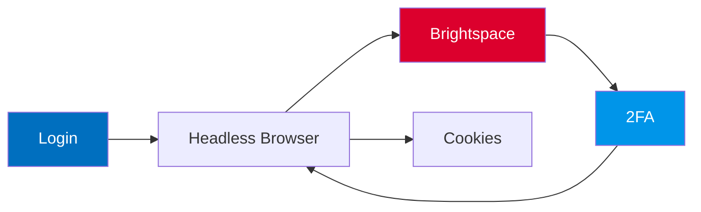
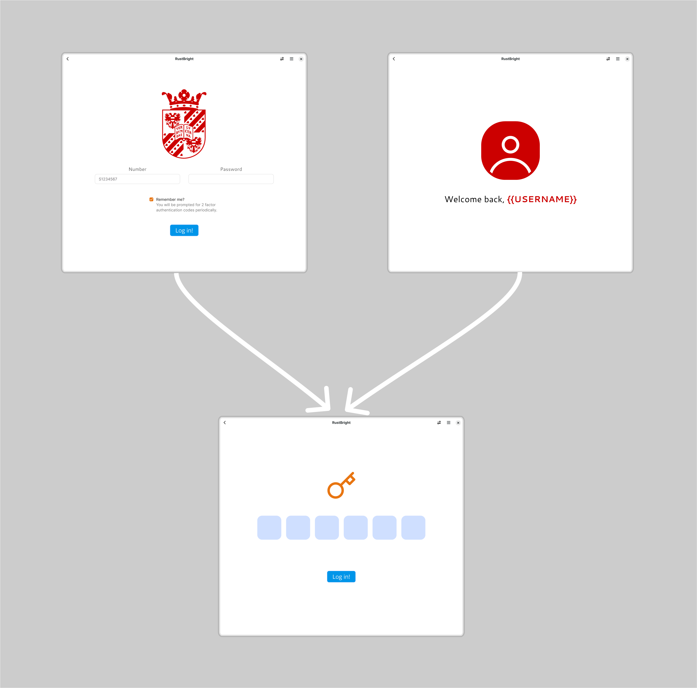
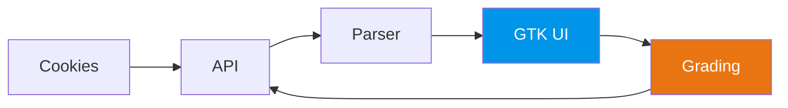
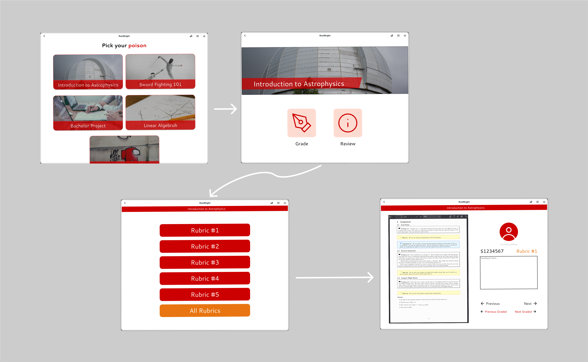
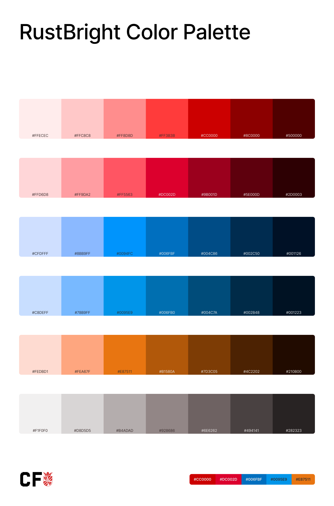

# rustbright
Brightspace UI (specifically for TAs) written in Rust.

## Resources
- [Gtk-rs](https://gtk-rs.org/)
- [Gnome design repository](https://gitlab.gnome.org/Teams/Design/)
- [Gtk-4 docs](https://docs.gtk.org/gtk4/)
- [Brightspace API documentation](https://docs.valence.desire2learn.com/reference.html)

## Design
Inspired by Gnome's design principles.

### Authentication

(might be a bit overkill)

#### Mockup

### Application Flow

#### Main UI Mockup

### UI Styling
View course content, grades, and assignments in a user-friendly interface.

#### Colors

| Color Name | Hex Code | Preview | Usage |
|------------|----------|---------|-------|
| University Red | `#CC0000` |  | Primary brand color (University of Groningen) |
| Brightspace Dark Red | `#DC002D` |  | Secondary accent color |
| Brightspace Blue | `#006FBF` |  | Background color for Brightspace elements |
| Brightspace Light Blue | `#0095E9` |  | Highlight color for links and buttons |
| Brightspace Orange | `#E87511` |  | Accent color for notifications and alerts |

#### Fonts
| Font Name | Usage |
|------------|-------|
| Cantarell | Primary font for headings and titles (faithful to Gnome) |
| Roboto | Secondary font for UI elements and buttons |

Very modern design!

## TODOs
- [ ] Review assignments and grades (maybe outside of scope for now)
- [ ] Actually implement shit

